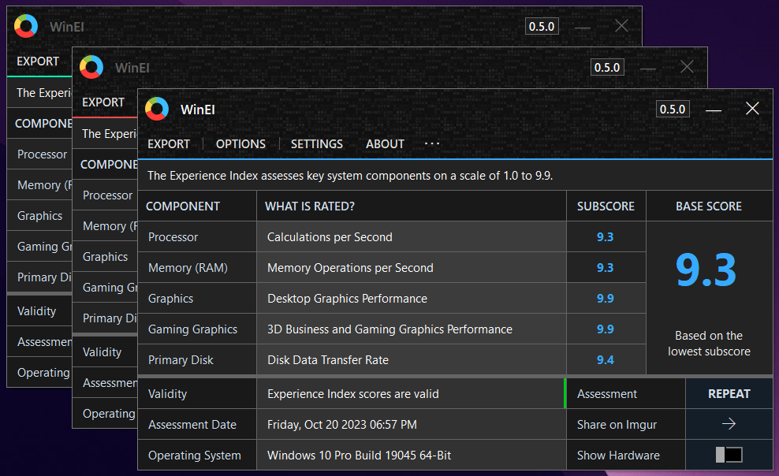

<h1 align="center">

<br>
WinEI
</h1>

<h4 align="center">WinEI brings back a UI for the Windows Experience Index.</h4>
<p align="center">
  <a href="#about">About</a> •
  <a href="#key-features">Key Features</a> •
  <a href="#system-requirements">System Requirements</a> •
  <a href="#acknowledgements">Acknowledgements</a> •
  <a href="#license">License</a> •
  <a href="#donate">Donate</a>
</p>

## About
> 🛈 Application is currently in late development. Pre-alpha development almost over.

Formerly known as **Xiret**, WinEI serves as a straightforward tool developed to substitute the Windows Experience Index User Interface, which was removed in Windows 8.1. This tool offers a user-friendly interface, is entirely free of advertisements and spam, and is available for free. It is compatible with all Windows versions capable of running the Experience Index. This application is a complete rewrite of [Xiret](https://www.majorgeeks.com/files/details/xiret.html), now in C#.

<kbd>
  
</kbd>

#### Key Features
- User-friendly UI designed to cater to both novice and expert users.
- The 'Show Hardware' toggle instantly shows you which hardware was rated.
- Effortless viewing and generation of Windows Experience Index scores.
- Integration with the Imgur API for easy and quick uploads to share your results.
- Developed using the WinSAT API for broad compatibility.
- Supports high DPI.
- Self-monitoring for missing resources like fonts and patches.
- Includes uncaught exception handling with log generation.
- Provides options to save scores as text or images.
- Offers a one-click option to reset WinSAT.
- A portable tool with easily managed settings.
- Automatic power adapter detection

#### System Requirements
```
Processor: 1.00 GHz Pentium 4, or AMD Athlon
Memory:    1.00 GB
Graphics:  64 MB DirectX 9 Compatible, pixel shader 2.0
Disk:      25 MB recommended
Software:  Windows Vista to 11, x86, x64.

WinSAT components are required.
Internet connectivity is necessary for automatic update checking, and Imgur uploads.
```

## Acknowledgements
- Application icon by [Andrean Prabowo](https://www.flaticon.com/free-icon/pie-chart_3589888).
- Title sprite by [Gre3g](https://gre3g.livejournal.com/), downloaded from [Transparent Textures](https://www.transparenttextures.com/patterns/3px-tile.png).

## License
This software is licensed under the [GNU General Public License v3.0](https://choosealicense.com/licenses/gpl-3.0/).

## Donate
All donations go back into improving my software and workspace.

<a href="https://www.paypal.com/donate/?hosted_button_id=Z88F3UEZB47SQ"></a>