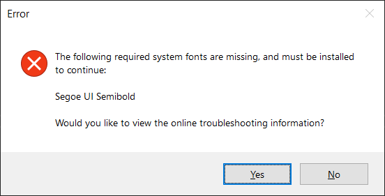

## Troubleshooting

### Bugged WinSAT:

**Overview:**\
The operating system is using a version of WinSAT that may encounter issues while assessing the system. The error can occur during the system assessment, and the message may indicate: "Failed to properly assess the disk. The parameter is incorrect.". For more details, refer to [this article](https://support.microsoft.com/en-us/topic/-the-parameter-is-incorrect-error-message-when-you-run-winsat-in-windows-7-b8c320cc-ce3f-70a7-593e-8aa3ed3b5b5f).

**Affected Operating Systems:**
```
Windows 7 32-bit, and 64-bit.
```

**Affected WinSAT Executables:**
```
%SystemDrive%/Windows/System32/WinSAT.exe

6.1.7600.16976
6.1.7600.21167
6.1.7601.17793
6.1.7601.21940
```

**Resolution**:

A hotfix is provided by Microsoft and can be downloaded from one of the following links, based on your Operating System architecture. If you're unsure about the architecture, you can check it in WinEI by opening the 'System Details' window (ALT + D) and examining the Operating System Text.

For 32-Bit Windows 7: [Windows6.1-KB2687862-x86.msu](https://github.com/MuertoGB/WinEI/raw/main/stream/hotfix/Windows6.1-KB2687862-x86.msu)\
For 64-Bit Windows 7: [Windows6.1-KB2687862-x64.msu](https://github.com/MuertoGB/WinEI/raw/main/stream/hotfix/Windows6.1-KB2687862-x64.msu)

<kbd>
	
</kbd>

---

### Missing Fonts:

**Overview:**\
While starting the application, you might encounter a message indicating missing fonts. In such a case, the application will exit as it cannot function correctly without them. To ensure proper functionality, it is mandatory that the following fonts are installed:

```
Segoe UI Regular  (segoeui.ttf)
Segoe UI Semibold (seguisb.ttf)
Segoe UI Bold     (segoeuib.ttf)
```

**Resolution:**\
You can obtain the missing fonts from the following link and install them to your system. To do so, download the font(s), unpack if necessary, and then right-click and select 'Install', or 'Install for all Users', depending on your preference.

[Required System Fonts](https://github.com/MuertoGB/WinEI/tree/main/stream/fonts) - Click each required font, then select 'View raw' to download.

For the best user experience on Windows Vista, it is recommended to install these fonts over the outdated versions. Doing so can enhance the visual clarity of the application.

<kbd>
	
</kbd>

---

### Assessment Error 21:

**Overview:**\
The system assessment will fail with error 21.

**Resolution:**\
This issue can result from third-party codecs or low space on the system's primary storage device. I recommend removing any third-party codecs and verifying that there is sufficient disk space available.

### Gaming Graphics always scores 9.9:

Starting from Windows 10, the D3D assessment is no longer executed. The returned score of 9.9 is a fixed sentinel value.